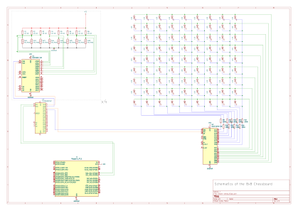
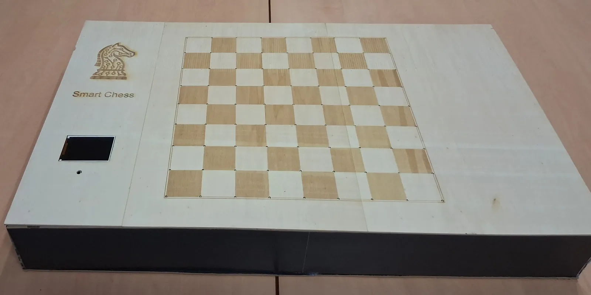
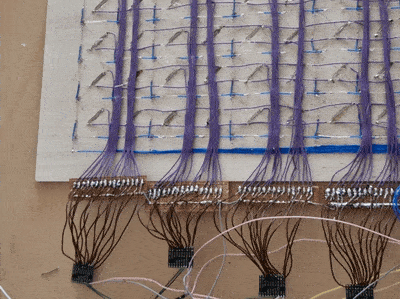
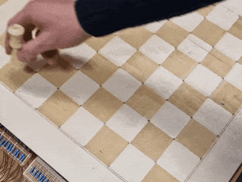

<div align="center">

# SmartChess

**Play chess alone against an AI with an adaptive level, on a real wooden board.<br/>It feels every piece, lights every move and moves the AI's pieces by itself.**

[](LICENSE)
[](#hardware)
[](#quick-start)
[](prototypes/echiquier_8x8/hardware/8x8.pdf)

<a href="https://www.youtube.com/watch?v=5BC216xx9qs"></a>

<sub>Click on the gif to watch the project video retrospective</sub>

</div>

## Highlights

- **Tracks and lights every move.** A reed switch under each of the 64 squares senses the magnet in the piece base. 81 LEDs at the square corners then light the start and arrival squares.
- **Checks with a camera.** A CNN finds the board corners (96 % accuracy, about 30 ms per image) and Lucas–Kanade optical flow tracks them. The result is compared with the reed sensors.
- **Plays back.** Our own chess AI runs on the Raspberry Pi 5, with 8 levels (target 400–2400 ELO) and 6 playing styles.
- **Moves its own pieces.** The Raspberry Pi drives an XY gantry under the board. An electromagnet holds the piece from below and slides it to its square.

## How it works

1. You move a piece. The reed switches see it leave one square and land on another.
2. The Raspberry Pi checks the move with `python-chess` and lights the corners of both squares.
3. IA-Marc V2 chooses a reply.
4. The Raspberry Pi drives the gantry, which slides the AI's piece, and the LEDs show the move.

## System schematic

<a href="prototypes/echiquier_8x8/hardware/8x8.svg"></a>

## Build

<table>
  <tr>
    <td colspan="2" align="center">
      
      <br/><sub>Side view: power supply and controllers in the base</sub>
    </td>
  </tr>
  <tr>
    <td width="50%" align="center" valign="top">
      
      <br/><sub>Wiring under the top plate, LED test</sub>
    </td>
    <td width="50%" align="center" valign="top">
      
      <br/><sub>Real-time detection: piece placement triggers reed sensors and illuminates corner LEDs.</sub>
    </td>
  </tr>
</table>

## Hardware

| Part | Qty | Role |
|---|:-:|---|
| Raspberry Pi 5 | 1 | Game loop, engine, vision, gantry control |
| TCA9548A | 1 | I²C multiplexer (`0x72`) |
| MCP23017 | 4 | 16 reed switches each (`0x20`, channels 0–3) |
| Reed switch + magnet | 64 | One per square, magnet in each piece base |
| HT16K33 | 2 | LED drivers (`0x70`, `0x71`, channels 4–5) |
| LED | 81 | 9 × 9 grid at the square corners |
| ILI9341 TFT, 320 × 240 | 1 | Game screen (SPI) |
| USB camera | 1 | Vision check |
| A4988 / DRV8825 + NEMA 17 | 2 | XY gantry: MGN12 rails, GT2 belts, 1/16 step |
| 12 V electromagnet + IRLZ44N | 1 | Holds the piece from below |
| 12 V 4 A supply + 12 → 5 V buck | 1 | Power |

## Our own chess AI

IA-Marc V2 uses NegaMax with alpha-beta pruning, iterative deepening with aspiration windows, quiescence search, null-move pruning, late move reductions, a transposition table, killer and history heuristics, Lazy SMP on 4 threads and PeSTO evaluation. It reads Polyglot opening books and runs 2–3× faster under PyPy.

<details>
<summary><b>Difficulty levels</b> (ELO values are targets, not measured ratings)</summary>

| Level | Target ELO | Depth | Time | Error rate |
|---|:-:|:-:|:-:|:-:|
| Enfant | 400 | 1 | 0.3 s | 40 % |
| Débutant | 600 | 2 | 0.5 s | 30 % |
| Amateur | 1000 | 3 | 1 s | 20 % |
| Club | 1400 | 4 | 2 s | 10 % |
| Compétition | 1800 | 6 | 4 s | 5 % |
| Expert | 2000 | 8 | 8 s | 2 % |
| Maître | 2200 | 10 | 15 s | 0 % |
| Maximum | 2400 | 20 | 30 s | 0 % |

Playing styles: aggressive, defensive, positional, tactical, materialist, balanced.

</details>

## Quick start

**Without hardware**, play against the engine in your browser:

```bash
git clone https://github.com/promaaa/smart-chess.git && cd smart-chess
./interface_utilisateur/start.sh    # creates ./venv, then opens http://localhost:8080
```

**On the board** (Raspberry Pi 5, Raspberry Pi OS 64-bit, Python 3.10+):

```bash
python3 -m venv venv && source venv/bin/activate
pip install -r ai/ia_marc/V2/requirements.txt -r prototypes/echiquier_8x8/firmware/requirements.txt
python3 prototypes/echiquier_8x8/firmware/ia_embarquee/chess_game_v2.py
```

## Repository

```
ai/ia_marc/V2/                      IA-Marc V2 engine (current)
ai/ai_Maëlle/ · ai/NeuralNet/       second engine · neural evaluation experiments
prototypes/echiquier_8x8/firmware/  game loop, vision, hardware tests
prototypes/echiquier_8x8/hardware/  KiCad schematic of the sensor and LED board
prototypes/echiquier_2x2/           2 × 2 proof of concept
interface_utilisateur/              browser simulator against the engine
interface_pvp_remote/               online player against the physical board
docs/                               images
```

## License

MIT, see [LICENSE](LICENSE). Built with [python-chess](https://python-chess.readthedocs.io/), the [PeSTO](https://www.chessprogramming.org/PeSTO%27s_Evaluation_Function) tables, the [Chess Programming Wiki](https://www.chessprogramming.org/) and Adafruit CircuitPython libraries.
